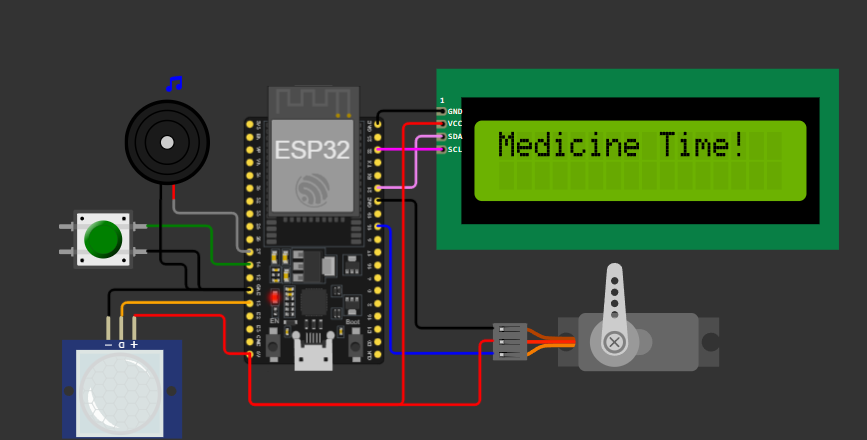
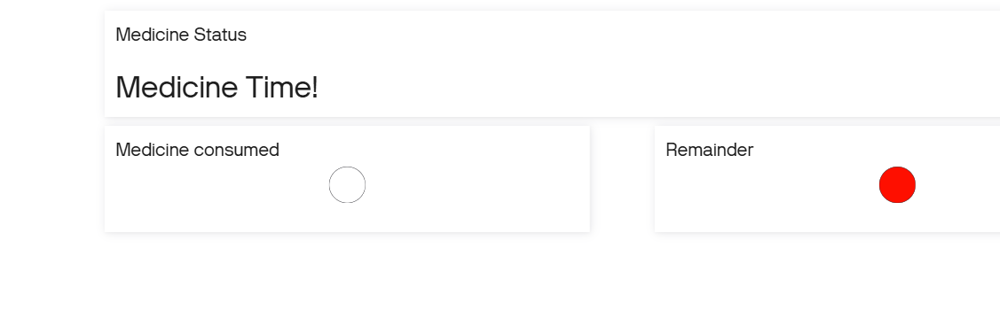
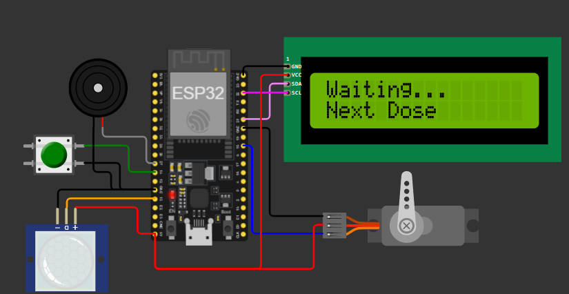
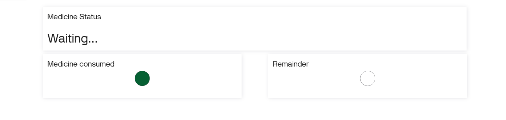

# Smart-Medicine-Box
The **IoT-Based Smart Medicine Reminder Box** uses an ESP32 to remind users to take their medication through a buzzer and 16×2 LCD display. A PIR sensor automatically opens the box using a servo motor, while a push button confirms medicine intake and updates the status on the Blynk IoT platform for remote monitoring.
##  Features
- Automatic medicine reminders
- 16×2 LCD status display
- PIR sensor for user detection
- Servo motor-controlled box opening
- Push button for intake confirmation
- Blynk IoT integration for remote monitoring

##  Components Used
- ESP32
- PIR Motion Sensor
- Servo Motor
- 16×2 LCD
- Buzzer
- Push Button
- Blynk IoT Platform

##  Software Used
- Wokwi Simulator
- Arduino IDE
- Blynk Cloud

##  How to Run
1. Open the project in Wokwi or Arduino IDE.
2. Replace the Blynk Template ID, Template Name, and Auth Token with your own values.
3. Upload the code to an ESP32 or run it in Wokwi.
4. Configure the corresponding widgets in the Blynk dashboard.

## Project Screenshots

<table>
  <tr>
    <td></td>
    <td></td>
    
  </tr>
  <tr>
    <td></td>
    <td></td>
  </tr>
</table>
